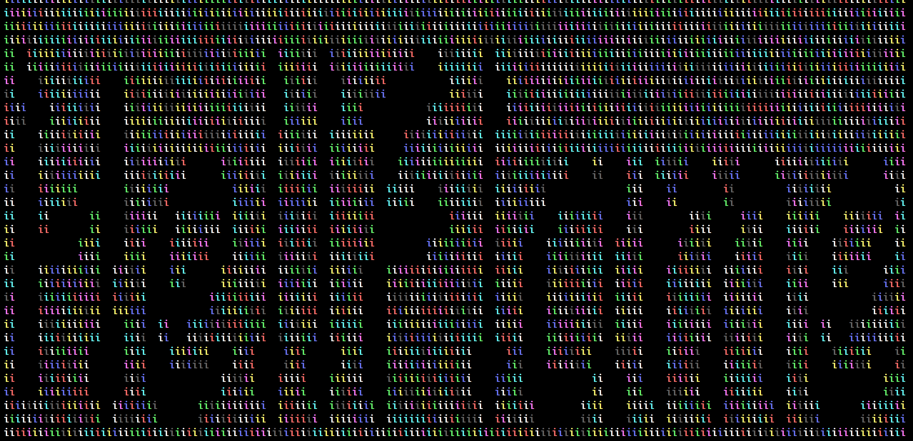
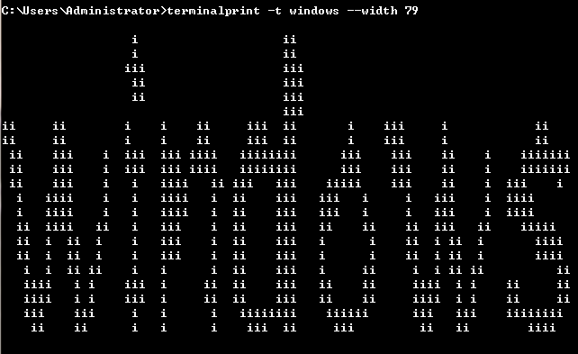

# Terminal Printer

输出字符图片到终端

(看惯了Retina，可能也想看看高清的马赛克)

[golang版本](https://github.com/hellflame/printer)

### 安装

```bash
$ pip install -U terminalprinter
# or
$ sudo install -U terminalprinter
# if permission issue happened on mac os
$ pip install -U terminalprinter --user
```

### 使用

```bash
$ terminalprint
```

以上命令，将输出默认的字符图到终端(命令太长？可使用用 *tab* 进行自动补全)


(分辨率较高的图片可能要花点时间来生成了)

#### i. 帮助信息

```bash
$ terminalprint -h
```

得到类似输出:

```bash
usage: run.py [-h] [-i] [-v] [--debug] [-kr] [-t TEXT] [-c i] [-g] [-F path]
              [-r] [-W w] [-H h] [-f i]
              [picture]

Terminal Printer

optional arguments:
  -h, --help            show this help message and exit

basics:
  -i, --init            初始化程序，下载字体
  -v, --version         输出版本信息
  --debug               输出调试信息

pictures:
  picture               可选的图片
  -kr, --keep-ratio     保持图片比例

text:
  -t TEXT, --text TEXT  设置将要处理的文本内容，默认为 HellFlame
  -c i, --color i       设置颜色
  -g, --gray            图像转换为灰度图(若指定图)
  -F path, --font path  设置书写字体
  -r, --reverse         反色(对彩色输出无效)

common:
  -W w, --width w       设置输出宽度，需要与高度一起设置
  -H h, --height h      设置输出高度，需要与宽度一起设置
  -f i, --filter i      设置打印填充方式

首次进行文字处理
需要执行 terminalprint -i 初始化或指定字体
更多帮助信息请参考: https://github.com/hellflame/terminal_printer
```

> v2.1.0 新增 `--debug` 参数，可与其他命令一起使用，输出调试信息

#### ii. 版本信息

```bash
$ terminalprint -v # terminalprint --version
```

#### iii. 初始化字体库

> 选择的字体都是可以支持大部分中文的字体，这5个字体是大多数系统没有安装的第三方字体，所以把这5个字体放在了用户目录下的一个隐藏文件目录，`~/.terminal_fonts/` ，5个字体的下载路径分别为：(可以手动下载保存在指定路径)

现在字体资源放在 [fonts](./fonts) ，也可点击 [下载完整字体包](./images/fonts.tar.gz)，解压将5个字体文件放到 `~/.terminal_fonts/` 即可

当然，可以直接通过以下命令初始化字体库:

```bash
$ terminalprint -i # terminalprint --init
```

#### iv. 设置文本内容

```bash
$ terminalprint -t 文字
```

默认情况下应该得到用默认字体写的用`i`填充的`文字`两个字:


#### v. 设置输出文字的格式

(1) 填充字符

```bash
$ terminalprint -f [filt_char]
```

可以设置的值范围1～223，代表ANSI可打印字符索引

(2) 渲染颜色

> 这需要彩色终端支持

```bash
$ terminalprint -c [color]
```

color值范围30～50，覆盖终端基本的16色

可以使用部分颜色名称如：`red`, `black`, `green`, `yellow`, `blue`, `magenta`, `cyan`, `white`

在上述颜色名称添加前缀 `bg-` 即可设置为对应背景色，如可设置背景蓝色：`bg-blue`

也可以使用随机颜色，只要颜色值是一个非颜色名称的字符串即可

```bash
$ terminalprint -c auto
```


(3) 输出宽度与高度

> 高度与宽度需要同时指定，否则尝试使用终端显示区域大小，若获取失败，则使用默认值

```bash
$ terminalprint --width 100 --height 20
```

当然，高宽过小，会导致输出的内容难以辨识出原来的样子，高宽过大，会导致终端中的换行出现，更难辨认。不过，可以将输出内容重定向到其他文本中，这样其他适合的屏幕就可以重现这一刻的样子了。

(4) 字体选择

> 部分Linux操作系统可能会因为选择truetype字体lib问题出错，需要自己手动处理。之所以使用下载字体的方式来渲染文字，是因为PIL默认使用的字体基本上只支持ANSI字符，中文字符什么的就变成了小框框=。=，可以自己设置一个不支持中文的字体，然后设置字体中用中文，就可以看到了。

输入数字，选择初始化时的字体，也可以输入字体路径，使用外部字体

```bash
$ terminalprint -F [index|font]
```

内部字体通过一个大于等于0的数字索引

外部字体通过给本地路径来获取

__对了，只绘制图片的话，并不需要字体支持__

(5) 反色

背景与文字填充字符互换

```bash
$ terminalprint -r
```



*最后，可以把以上这些命令交叉使用，获得混合效果，至于可观赏性，就不好说了*

#### vi. 渲染图片

> 这里需要256色终端支持！以下测试终端为 iterm

可以通过给定有效图片位置来将图片渲染到终端中

```bash
$ terminalprint [pic path]
```

理想的话，可能得到类似下面的输出:


但是，实际情况很可能是这样:


只有把终端字体设置的很小，才有可能看到很多细节，但是此时终端的背景色(黑色)也会更加影响视觉效果，在这里显得更暗了，而且输出也会很慢。

(1) 转换为灰度图

> 一般这种情况下需要把填充字符索引降低一些，使用 `-f 4` 看上去会好一些 

```bash
$ terminalprint -g [pic]
```

(2) 保持原图比例

> 虽然说是保持原图比例，但是由于终端中行距和字间距不同，可能看上去比例反而不合适

```bash
$ ternimalprint -kr [pic]
```

设置文字格式中的大部分命令可用，比如强制图片使用灰度图，并且控制填充字符索引不要太高，可能得到以下结果

```bash
# terminalprint [pic] -g -c 34 -f 4
```


这里的填充字符索引会多义为使用不超过ANSI中可打印字符码值不超过4的字符来表示不同的灰度级别，索引值越大，灰度的符号越多，看上去也会更杂乱。实际上，如果将索引调到最大的话，还是依稀可以看到原图的影子的，不过实际效果嘛，，，灰阶较少的图片也没有问题。

> windows cmd 虽然支持不多，但也基本能用，但颜色等特性无法使用



### 版本日志

好吧，`v1.3.0` 之前的版本都是在几年前写的，当时也没有想过要记录什么的问题，所以版本日志从 `v1.3.3` 开始

- v1.3.0 ～ v1.3.2

从1.3.0开始，代码开始写的认真一点了，曾经的代码到现在看来真的完全不能入目的感觉=。=完全不知道在想什么，虽然也不确定现在重写之后会不会被更久之后吐槽。

- v1.3.3

这次主要添加了一个http库，来自qiniumanager那个小工具，不过为了能够支持自己静态文件服务器的chunked编码，还有py3中bytes和str交互的问题，把这个模块重要的响应报文处理部分重写了一下，主要是取消了 `StringIO` 的使用，因为 `StringIO` 需要把Bytes转换成String，然而Bytes在转换成Stirng的过程中，二进制文件内容会报错，如果忽略错误(error="ignore")的话，会导致内容长度计数不准，最终进度条卡在一个地方动弹不得，就是因为ignore。而且 StringIO 的转换过程也会带来一定的计算损耗，手动获取 `\r\n` 最终也没有多费事，但是想了很多=。= 不过，发现一个http库代码比主要程序的长度还要长出一大截，这样是不是不太好，，，

然后由于 `pypy3` 里安装 `Pillow` 的时候会发生报错，也就没有测试 pypy 了，CPython3 应该能够完全支持了。从此，初始化字体的时候就可以看到进度条了，之后应该会把qiniu里的资源换到自己的静态服务器上。

在字符输出上面，修复了随机颜色输出时候的颜色晦暗问题，现在亮度要好很多了，图片打印看上去也更生动了！(最生动的还是直接看原图=。=) 不过，字体缩太小，输出窗口太大，输出时间依然还是很长的样子=。=

- v1.3.4

切换字体文件到自己的静态文件服务器

http下载库优化，包括进度条输出以及单位转换宽度固定

- v1.5.0

  优化代码结构

  修复带透明度图片输出bug

- v1.6.0

  兼容py3下面的问题

- v2.0.0

  易用性更新

- v2.1.0

  新增调试入口

- v2.2.0

  新增颜色名称支持

  输出长宽更自由
------

嗯，以上，Just For Fun!
